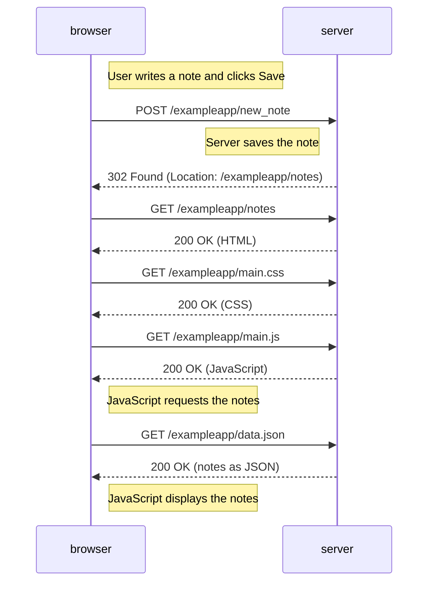

```mermaid
sequenceDiagram
    participant browser
    participant server

    Note right of browser: User writes a note and clicks Save
    browser->>server: POST /exampleapp/new_note
    Note left of server: Server saves the note
    server-->>browser: 302 Found (Location: /exampleapp/notes)

    browser->>server: GET /exampleapp/notes
    server-->>browser: 200 OK (HTML)

    browser->>server: GET /exampleapp/main.css
    server-->>browser: 200 OK (CSS)

    browser->>server: GET /exampleapp/main.js
    server-->>browser: 200 OK (JavaScript)

    Note right of browser: JavaScript requests the notes
    browser->>server: GET /exampleapp/data.json
    server-->>browser: 200 OK (notes as JSON)
    Note right of browser: JavaScript displays the notes
```
